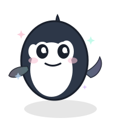

# 🐳✨ Little Orca's Questionable Wisdom

A fun, interactive one-page experience where a cute animated orca mascot gives you unhinged, chaotic-but-wholesome life advice.



## ✨ Features

- **Cute Orca Mascot**: Animated SVG orca with sparkly eyes, blush, and smooth animations
- **1000+ Chaotic Advice**: Unhinged but wholesome wisdom to brighten your day
- **Beautiful Animations**: Float, pop, bounce, and confetti effects
- **Pastel Design**: Soft gradients in blue, purple, and pink
- **Fully Responsive**: Works perfectly on mobile and desktop
- **Static Site**: No backend needed - deploy anywhere instantly

## 🎨 Design

- Pastel gradient background
- Glass morphism effects
- Neumorphic buttons
- Emoji-filled advice cards
- Confetti celebrations
- Toast notifications

## 🚀 Quick Start

### Prerequisites

- Node.js 18+ and npm

### Installation

1. **Clone the repository**
```bash
git clone <your-repo-url>
cd questionable-orca
```

2. **Install dependencies**
```bash
npm install
```

3. **Run development server**
```bash
npm run dev
```

4. **Open your browser**
Navigate to [http://localhost:3000](http://localhost:3000)

## 📦 Build for Production

Build the static site:

```bash
npm run build
```

The output will be in the `out/` directory, ready to deploy!

## 🌐 Deploy to Vercel

### One-Click Deploy

The easiest way to deploy is using Vercel:

[](https://vercel.com/new)

### Manual Deploy

1. **Install Vercel CLI** (if not already installed)
```bash
npm install -g vercel
```

2. **Deploy**
```bash
vercel
```

3. **Follow the prompts** and your site will be live!

### Vercel Configuration

The project is already configured for static export via `next.config.js`:

```javascript
{
  output: 'export',
  images: { unoptimized: true }
}
```

## 📁 Project Structure

```
questionable-orca/
├── app/
│   ├── components/
│   │   ├── OrcaMascot.tsx      # Animated orca SVG
│   │   ├── AdviceCard.tsx      # Advice display card
│   │   ├── Toast.tsx           # Toast notifications
│   │   ├── AdBox.tsx           # Ad placeholders
│   │   └── Confetti.tsx        # Confetti animation
│   ├── globals.css             # Global styles
│   ├── layout.tsx              # Root layout
│   └── page.tsx                # Main page
├── public/
│   ├── advice.json             # 1000+ advice items
│   └── orca.svg                # Orca mascot SVG
├── tailwind.config.js          # Tailwind configuration
├── next.config.js              # Next.js configuration
└── package.json                # Dependencies
```

## 🎭 Tech Stack

- **Framework**: Next.js 14 (App Router)
- **Language**: TypeScript
- **Styling**: Tailwind CSS
- **Animations**: Custom CSS keyframes
- **Deployment**: Static export (works on any static host)

## 🎨 Customization

### Add More Advice

Edit `public/advice.json` to add your own advice:

```json
{
  "id": 1001,
  "text": "Your custom advice here!",
  "emoji": "🎉"
}
```

### Change Colors

Edit `tailwind.config.js` to customize the pastel color palette:

```javascript
colors: {
  'pastel-blue': '#B8D4F1',
  'pastel-purple': '#D4B5F9',
  'pastel-pink': '#F9C5D5',
  'pastel-mint': '#B5F9E5',
}
```

### Modify Animations

Check `tailwind.config.js` for animation configurations:
- `float`: Gentle up/down movement
- `pop`: Scale-in effect
- `bounce-gentle`: Soft bounce
- `slide-up`: Slide from bottom
- `confetti`: Falling emoji particles

## 🐳 The Orca Mascot

Little Orca features:
- Big sparkly eyes with highlights
- Adorable blush cheeks
- Round, chubby body
- Smooth floating animation
- Pop and spin effects when delivering wisdom
- Pastel gradient accents

## 📝 Scripts

- `npm run dev` - Start development server
- `npm run build` - Build for production
- `npm start` - Start production server
- `npm run lint` - Run ESLint

## 🌟 Features Breakdown

### Advice System
- **1000+ unique items**: Chaotic, wholesome, and unhinged
- **Random selection**: Each click gives you something new
- **Categorized by tone**: From motivational chaos to existential humor

### Animations
- **Orca animations**: Float, pop, bounce, and spin
- **Confetti system**: 50 emoji particles with physics
- **Smooth transitions**: All interactions feel premium
- **Toast notifications**: Cute confirmation messages

### UI Components
- **Glass morphism cards**: Modern, translucent design
- **Neumorphic buttons**: Soft, tactile feel
- **Responsive layout**: Perfect on all screen sizes
- **Ad placeholders**: Non-intrusive, blended design

## 🎯 Browser Support

- Chrome (latest)
- Firefox (latest)
- Safari (latest)
- Edge (latest)
- Mobile browsers

## 📄 License

This project is open source and available under the MIT License.

## 🙏 Acknowledgments

- Inspired by the chaotic wisdom of the internet
- Built with love and questionable life choices
- Powered by Little Orca's unfiltered thoughts

## 🐳 Have Fun!

Click the button, get wisdom, question everything, apply nothing. That's the Little Orca way! ✨

---

**Made with 🐳 by Little Orca** | **Chaos Guaranteed** | **Wisdom Questionable**
